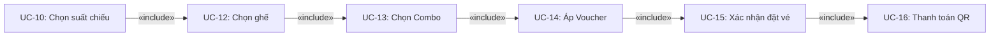
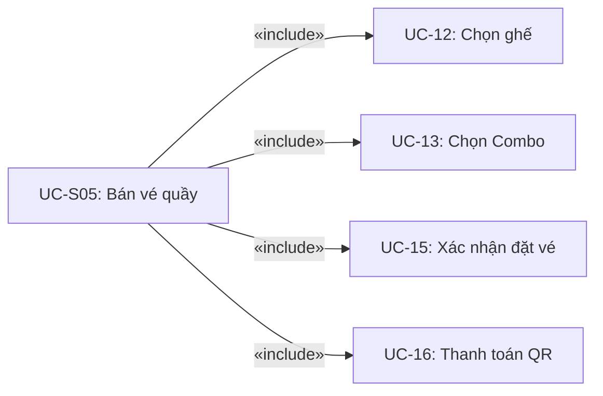

# ĐẶC TẢ USE CASE — HỆ THỐNG MOVIEZONE

> **Dự án:** Hệ thống đặt vé & quản lý rạp chiếu phim MovieZone  
> **Công nghệ:** Laravel + MySQL + Vite  
> **Phiên bản:** 1.0  
> **Ngày cập nhật:** 2026-07-27

---

## MỤC LỤC

1. [Tổng quan hệ thống](#1-tổng-quan-hệ-thống)
2. [Danh sách tác nhân (Actors)](#2-danh-sách-tác-nhân-actors)
3. [Đặc tả Use Case — Khách hàng (Customer)](#3-đặc-tả-use-case--khách-hàng-customer)
4. [Đặc tả Use Case — Nhân viên (Staff)](#4-đặc-tả-use-case--nhân-viên-staff)
5. [Đặc tả Use Case — Quản trị viên (Admin)](#5-đặc-tả-use-case--quản-trị-viên-admin)
6. [Luồng include — Đặt vé](#6-luồng-include--đặt-vé)
7. [Ma trận phân quyền (RBAC)](#7-ma-trận-phân-quyền-rbac)
8. [Biểu đồ luồng nghiệp vụ](#8-biểu-đồ-luồng-nghiệp-vụ)
9. [Kết nối hệ thống ngoài](#9-kết-nối-hệ-thống-ngoài)

---

## 1. TỔNG QUAN HỆ THỐNG

### 1.1. Giới thiệu

MovieZone là hệ thống đặt vé xem phim trực tuyến và quản lý rạp chiếu phim toàn diện. Hệ thống hỗ trợ ba nhóm người dùng chính:

- **Khách hàng (Customer):** Xem phim, đặt vé, thanh toán online, đánh giá phim, tích lũy điểm thưởng.
- **Nhân viên (Staff):** Check-in vé, bán vé tại quầy, tra cứu booking, hỗ trợ sự cố.
- **Quản trị viên (Admin):** Quản lý toàn bộ hệ thống (phim, phòng chiếu, suất chiếu, tài khoản, sản phẩm/dịch vụ).

### 1.2. Thống kê Use Case

| Nhóm tác nhân | Số lượng UC | Ký hiệu |
|---------------|:-----------:|:-------:|
| 👤 Khách hàng (Customer) | **23** | UC-01 → UC-23 |
| 🧑‍💼 Nhân viên (Staff) | **5** | UC-S01 → UC-S05 |
| 🛡️ Quản trị viên (Admin) | **12** | UC-A01 → UC-A12 |
| **Tổng cộng** | **~40** | |

---

## 2. DANH SÁCH TÁC NHÂN (ACTORS)

| Actor | Mô tả | Quyền hạn |
|-------|-------|-----------|
| **Khách hàng (Customer)** | Người dùng cuối của hệ thống, có thể đăng ký, đặt vé, xem phim | Role: CUSTOMER |
| **Nhân viên (Staff)** | Nhân viên rạp chiếu phim, thực hiện check-in, bán vé tại quầy, hỗ trợ khách hàng | Role: STAFF |
| **Quản trị viên (Admin)** | Quản trị hệ thống, quản lý toàn bộ dữ liệu và cấu hình | Role: ADMIN, SUPER_ADMIN |
| **Google OAuth** | Hệ thống xác thực qua Google (hệ thống ngoài) | — |
| **Sepay** | Cổng thanh toán QR Code qua ngân hàng (hệ thống ngoài) | — |
| **Gemini AI** | Trí tuệ nhân tạo hỗ trợ chatbot (hệ thống ngoài) | — |
| **Email Service** | Dịch vụ gửi email (hệ thống ngoài) | — |

---

## 3. ĐẶC TẢ USE CASE — KHÁCH HÀNG (CUSTOMER)

### 3.1. NHÓM QUẢN LÝ TÀI KHOẢN (6 UC)

---

#### UC-01: ĐĂNG KÝ TÀI KHOẢN

| Mục | Mô tả |
|-----|-------|
| **Mã UC** | UC-01 |
| **Tên** | Đăng ký tài khoản |
| **Tác nhân chính** | Khách hàng (chưa đăng nhập) |
| **Tiền điều kiện** | Người dùng chưa có tài khoản; email và số điện thoại chưa tồn tại trong hệ thống |
| **Hậu điều kiện** | Tài khoản mới được tạo với role CUSTOMER, trạng thái ACTIVE; người dùng được chuyển đến trang đăng nhập |
| **Mô tả** | Cho phép khách hàng tạo tài khoản mới bằng email và mật khẩu |

**Luồng cơ bản:**
1. Người dùng truy cập trang `/register`
2. Hệ thống hiển thị form đăng ký (tên, email, số điện thoại, mật khẩu, xác nhận mật khẩu)
3. Người dùng nhập thông tin và submit
4. Hệ thống validate dữ liệu:
   - Tên: bắt buộc, string, max 255
   - Email: bắt buộc, đúng format, unique trong bảng `users`
   - Số điện thoại: bắt buộc, đúng định dạng (regex), unique
   - Mật khẩu: bắt buộc, tối thiểu 8 ký tự, có xác nhận
5. Hệ thống tạo user mới với `status = ACTIVE`, `role = CUSTOMER`
6. Hệ thống redirect đến trang đăng nhập kèm thông báo thành công

**Luồng thay thế:**
- **3a.** Email đã tồn tại: Hệ thống hiển thị lỗi "Email đã được đăng ký"
- **3b.** Số điện thoại đã tồn tại: Hệ thống hiển thị lỗi "Số điện thoại đã được đăng ký"
- **3c.** Mật khẩu xác nhận không khớp: Hiển thị lỗi "Mật khẩu xác nhận không đúng"
- **3d.** Dữ liệu không hợp lệ: Hiển thị lỗi validate tương ứng

**Ràng buộc nghiệp vụ:**
- Email phải là duy nhất trong hệ thống
- Số điện thoại phải là duy nhất trong hệ thống
- Mật khẩu phải có ít nhất 8 ký tự

---

#### UC-02: ĐĂNG NHẬP

| Mục | Mô tả |
|-----|-------|
| **Mã UC** | UC-02 |
| **Tên** | Đăng nhập |
| **Tác nhân chính** | Khách hàng, Nhân viên, Quản trị viên |
| **Tiền điều kiện** | Người dùng chưa đăng nhập; tài khoản tồn tại và ở trạng thái ACTIVE |
| **Hậu điều kiện** | Người dùng được xác thực và chuyển đến trang tương ứng (home/customer, staff dashboard, admin dashboard) |
| **Mô tả** | Cho phép người dùng đăng nhập bằng email + mật khẩu hoặc qua Google OAuth |

**Luồng cơ bản (Email + Password):**
1. Người dùng truy cập trang `/login`
2. Hệ thống hiển thị form đăng nhập (email, mật khẩu)
3. Người dùng nhập email và mật khẩu, submit
4. Hệ thống kiểm tra thông tin đăng nhập:
   - Email tồn tại trong hệ thống
   - Mật khẩu chính xác (hash bcrypt)
   - Tài khoản có status = ACTIVE
5. Hệ thống tạo session đăng nhập
6. Redirect dựa trên role: CUSTOMER → trang chủ; STAFF → /staff; ADMIN → /admin

**Luồng thay thế:**
- **3a.** Email không tồn tại hoặc sai mật khẩu: Hiển thị lỗi "Email hoặc mật khẩu không đúng"
- **3b.** Tài khoản bị khóa (status ≠ ACTIVE): Hiển thị lỗi "Tài khoản đã bị khóa"
- **3c.** Đăng nhập bằng Google: Chuyển hướng đến Google OAuth, sau callback tạo/đăng nhập tài khoản

**Ràng buộc nghiệp vụ:**
- Tài khoản bị khóa không thể đăng nhập
- Phân quyền redirect theo role

---

#### UC-03: ĐĂNG XUẤT

| Mục | Mô tả |
|-----|-------|
| **Mã UC** | UC-03 |
| **Tên** | Đăng xuất |
| **Tác nhân chính** | Khách hàng (đã đăng nhập) |
| **Tiền điều kiện** | Người dùng đã đăng nhập |
| **Hậu điều kiện** | Session bị hủy, người dùng chuyển về trang chủ |
| **Mô tả** | Cho phép người dùng thoát phiên đăng nhập |

**Luồng cơ bản:**
1. Người dùng click nút "Đăng xuất" hoặc truy cập `POST /logout`
2. Hệ thống hủy session và redirect về trang chủ

---

#### UC-04: QUÊN MẬT KHẨU

| Mục | Mô tả |
|-----|-------|
| **Mã UC** | UC-04 |
| **Tên** | Quên mật khẩu |
| **Tác nhân chính** | Khách hàng (chưa đăng nhập) |
| **Tiền điều kiện** | Tài khoản email tồn tại trong hệ thống |
| **Hậu điều kiện** | Email chứa link đặt lại mật khẩu được gửi đến địa chỉ email |
| **Mô tả** | Cho phép người dùng yêu cầu đặt lại mật khẩu qua email |

**Luồng cơ bản:**
1. Người dùng truy cập `/forgot-password`
2. Nhập email đã đăng ký
3. Hệ thống kiểm tra email tồn tại
4. Hệ thống tạo token reset password, lưu vào database
5. Gửi email chứa link `/reset-password/{token}` đến email người dùng
6. Hiển thị thông báo "Vui lòng kiểm tra email"

**Luồng thay thế:**
- **3a.** Email không tồn tại: Hiển thị lỗi "Email không tồn tại trong hệ thống"

---

#### UC-05: ĐẶT LẠI MẬT KHẨU

| Mục | Mô tả |
|-----|-------|
| **Mã UC** | UC-05 |
| **Tên** | Đặt lại mật khẩu |
| **Tác nhân chính** | Khách hàng (có token hợp lệ) |
| **Tiền điều kiện** | Token reset password hợp lệ và chưa hết hạn |
| **Hậu điều kiện** | Mật khẩu mới được cập nhật; token bị hủy |
| **Mô tả** | Cho phép người dùng tạo mật khẩu mới từ link trong email |

**Luồng cơ bản:**
1. Người dùng click link trong email → truy cập `/reset-password/{token}`
2. Hệ thống hiển thị form nhập mật khẩu mới + xác nhận
3. Người dùng nhập mật khẩu mới và submit
4. Hệ thống validate token, cập nhật mật khẩu
5. Redirect đến trang đăng nhập kèm thông báo thành công

**Luồng thay thế:**
- **2a.** Token không hợp lệ hoặc hết hạn: Hiển thị lỗi "Link đặt lại mật khẩu không hợp lệ hoặc đã hết hạn"

---

#### UC-06: XEM/SỬA HỒ SƠ + ĐỔI MẬT KHẨU

| Mục | Mô tả |
|-----|-------|
| **Mã UC** | UC-06 |
| **Tên** | Xem/Sửa hồ sơ + Đổi mật khẩu |
| **Tác nhân chính** | Khách hàng (đã đăng nhập) |
| **Tiền điều kiện** | Người dùng đã đăng nhập |
| **Hậu điều kiện** | Thông tin hồ sơ hoặc mật khẩu được cập nhật |
| **Mô tả** | Cho phép người dùng xem và chỉnh sửa thông tin cá nhân, đổi mật khẩu |

**Luồng cơ bản (Xem hồ sơ):**
1. Người dùng truy cập `/profile`
2. Hệ thống hiển thị thông tin cá nhân (tên, email, số điện thoại, avatar)

**Luồng cơ bản (Sửa hồ sơ):**
1. Người dùng truy cập `/profile/edit`
2. Hệ thống hiển thị form chỉnh sửa (tên, số điện thoại, avatar)
3. Người dùng cập nhật thông tin và submit `POST /profile/update`
4. Hệ thống validate và cập nhật
5. Hiển thị thông báo thành công

**Luồng cơ bản (Đổi mật khẩu):**
1. Trong trang hồ sơ, người dùng nhập mật khẩu cũ + mật khẩu mới + xác nhận
2. Submit `PUT /profile/password`
3. Hệ thống kiểm tra mật khẩu cũ chính xác
4. Cập nhật mật khẩu mới (hash bcrypt)
5. Hiển thị thông báo thành công

**Luồng thay thế:**
- **3a.** Mật khẩu cũ không đúng: Hiển thị lỗi "Mật khẩu cũ không chính xác"
- **3b.** Email không được phép sửa (chỉ đọc)

---

### 3.2. NHÓM PHIM & LỊCH CHIẾU (4 UC)

---

#### UC-07: XEM DANH SÁCH PHIM

| Mục | Mô tả |
|-----|-------|
| **Mã UC** | UC-07 |
| **Tên** | Xem danh sách phim (lọc/thể loại) |
| **Tác nhân chính** | Khách hàng |
| **Tiền điều kiện** | Không |
| **Hậu điều kiện** | Hiển thị danh sách phim theo bộ lọc |
| **Mô tả** | Cho phép khách hàng xem danh sách phim, lọc theo thể loại, trạng thái (NOW_SHOWING/COMING_SOON) |

**Luồng cơ bản:**
1. Người dùng truy cập `/movies`
2. Hệ thống hiển thị danh sách phim đang chiếu (NOW_SHOWING) và sắp chiếu (COMING_SOON)
3. Người dùng có thể lọc theo:
   - Thể loại (genre)
   - Trạng thái (NOW_SHOWING / COMING_SOON)
4. Hệ thống cập nhật danh sách theo bộ lọc

**Luồng thay thế:**
- **3a.** Không có phim nào: Hiển thị thông báo "Không có phim nào"

---

#### UC-08: XEM CHI TIẾT PHIM

| Mục | Mô tả |
|-----|-------|
| **Mã UC** | UC-08 |
| **Tên** | Xem chi tiết phim + Trailer |
| **Tác nhân chính** | Khách hàng |
| **Tiền điều kiện** | Phim tồn tại |
| **Hậu điều kiện** | Hiển thị thông tin chi tiết phim |
| **Mô tả** | Cho phép khách hàng xem thông tin chi tiết phim (mô tả, trailer, đánh giá, diễn viên, ...) |

**Luồng cơ bản:**
1. Người dùng click vào phim từ danh sách → truy cập `/movies/{slug}`
2. Hệ thống hiển thị:
   - Poster, banner, trailer (YouTube embed)
   - Thông tin: tên, thời lượng, ngày chiếu, quốc gia, ngôn ngữ, đạo diễn, diễn viên
   - Độ tuổi (P, K, T13, T16, T18)
   - Thể loại
   - Đánh giá từ người dùng (rating trung bình + danh sách review)
   - Lịch chiếu của phim (nếu đang chiếu)

---

#### UC-09: XEM LỊCH CHIẾU

| Mục | Mô tả |
|-----|-------|
| **Mã UC** | UC-09 |
| **Tên** | Xem lịch chiếu |
| **Tác nhân chính** | Khách hàng |
| **Tiền điều kiện** | Không |
| **Hậu điều kiện** | Hiển thị lịch chiếu theo ngày, rạp, phòng |
| **Mô tả** | Cho phép khách hàng xem lịch chiếu của tất cả phim theo ngày |

**Luồng cơ bản:**
1. Người dùng truy cập `/showtimes`
2. Hệ thống hiển thị lịch chiếu theo ngày đã chọn
3. Người dùng có thể chọn ngày, xem suất chiếu theo rạp/phòng

---

#### UC-10: CHỌN SUẤT CHIẾU

| Mục | Mô tả |
|-----|-------|
| **Mã UC** | UC-10 |
| **Tên** | Chọn suất chiếu |
| **Tác nhân chính** | Khách hàng |
| **Tiền điều kiện** | Suất chiếu tồn tại, ở trạng thái OPEN, chưa bắt đầu |
| **Hậu điều kiện** | Chuyển đến màn hình chọn ghế (UC-12) |
| **Mô tả** | Cho phép khách hàng chọn suất chiếu để bắt đầu quy trình đặt vé. Luồng này là điểm bắt đầu của `«include»` đặt vé. |

**Luồng cơ bản:**
1. Người dùng click vào suất chiếu từ trang chi tiết phim hoặc lịch chiếu
2. Hệ thống kiểm tra suất chiếu còn hợp lệ
3. Chuyển hướng đến màn hình chọn ghế `/booking/showtime/{id}/seat`

**Luồng thay thế:**
- **2a.** Suất chiếu đã bắt đầu hoặc bị hủy: Hiển thị lỗi "Suất chiếu không khả dụng"

---

### 3.3. NHÓM ĐẶT VÉ (6 UC) — Luồng Include

> **Ghi chú:** Các UC từ UC-12 đến UC-16 tạo thành luồng đặt vé liên hoàn với quan hệ `«include»`.  
> `UC-10 → UC-12 → UC-13 → UC-14 → UC-15 → UC-16`

---

#### UC-11: CHATBOT HỖ TRỢ

| Mục | Mô tả |
|-----|-------|
| **Mã UC** | UC-11 |
| **Tên** | Chatbot hỗ trợ (Menu-based + Gemini AI) |
| **Tác nhân chính** | Khách hàng |
| **Tiền điều kiện** | Không |
| **Hậu điều kiện** | Người dùng nhận được câu trả lời từ chatbot |
| **Mô tả** | Cho phép khách hàng hỏi đáp thông qua chatbot AI (Gemini) về phim, lịch chiếu, thể loại, câu hỏi thường gặp |

**Luồng cơ bản:**
1. Người dùng gửi tin nhắn qua giao diện chatbot (`POST /api/chatbot`)
2. Hệ thống gọi Gemini lần 1 (`detectIntent`) để phân tích ý định:
   - `GREETING`: Chào hỏi
   - `MOVIE_SEARCH`: Tìm phim
   - `MOVIE_DETAIL`: Chi tiết phim
   - `GENRE_SEARCH`: Tìm theo thể loại
   - `SHOWTIME_SEARCH`: Lịch chiếu
   - `FAQ`: Câu hỏi thường gặp
3. Hệ thống truy vấn database dựa trên intent và entities
4. Hệ thống gọi Gemini lần 2 (`generateResponse`) với context từ database
5. Trả về câu trả lời tự nhiên cho người dùng

**Ràng buộc nghiệp vụ:**
- Gemini chỉ trả lời dựa trên dữ liệu từ database (tránh ảo giác/hallucination)
- Chatbot không thực hiện giao dịch (chỉ hỗ trợ thông tin)

---

#### UC-12: CHỌN GHẾ

| Mục | Mô tả |
|-----|-------|
| **Mã UC** | UC-12 |
| **Tên** | Chọn ghế (giữ 5 phút theo thời gian thực) |
| **Tác nhân chính** | Khách hàng |
| **Tiền điều kiện** | Suất chiếu hợp lệ, chưa bắt đầu; người dùng đã đăng nhập |
| **Hậu điều kiện** | Ghế được giữ tạm thời (5 phút); thông tin ghế đã chọn được lưu vào session |
| **Mô tả** | Cho phép khách hàng xem sơ đồ ghế, chọn ghế theo thời gian thực. Ghế được giữ trong 5 phút để ngăn người khác đặt cùng ghế. |

**Luồng cơ bản:**
1. Người dùng truy cập `/booking/showtime/{showtime_id}/seat`
2. Hệ thống hiển thị sơ đồ ghế của phòng chiếu, phân loại:
   - AVAILABLE: Ghế trống (màu xanh)
   - HELD: Ghế đang được giữ bởi người khác (màu vàng)
   - SOLD: Ghế đã bán (màu đỏ)
   - BLOCKED: Ghế bị khóa (màu xám)
   - BROKEN: Ghế hỏng (màu đen)
3. Người dùng click chọn ghế trống
4. Hệ thống gọi AJAX `POST /booking/hold-seat` để giữ ghế (5 phút)
5. Ghế chuyển sang trạng thái HELD (real-time broadcast)
6. Người dùng submit danh sách ghế `POST /booking/seats/submit`
7. Hệ thống lưu danh sách ghế vào session và chuyển sang UC-13

**Luồng thay thế:**
- **3a.** Ghế đã được giữ bởi người khác: Hiển thị thông báo "Ghế đang được chọn bởi người khác"
- **3b.** Ghế đã bán: Không cho phép chọn
- **3c.** Hết thời gian giữ ghế (5 phút): Ghế tự động trả về AVAILABLE
- **3d.** Người dùng không chọn ghế nào: Không cho phép submit (phải chọn ít nhất 1 ghế)
- **3e.** Validate nghiệp vụ: Không để lại ghế trống đơn lẻ trong hàng

**Ràng buộc nghiệp vụ:**
- Phải chọn ít nhất 1 ghế
- Không cho chọn ghế bị khóa/hỏng
- Không cho chọn ghế đã bán
- Không để lại ghế trống đơn lẻ ở hàng
- Timer giữ ghế: 5 phút (tự động hủy nếu hết giờ)
- Số lượng ghế tối đa: theo cấu hình hệ thống

---

#### UC-13: CHỌN COMBO

| Mục | Mô tả |
|-----|-------|
| **Mã UC** | UC-13 |
| **Tên** | Chọn Combo (bắp nước, đồ ăn lẻ) |
| **Tác nhân chính** | Khách hàng |
| **Tiền điều kiện** | Đã chọn ghế (session có seat data) |
| **Hậu điều kiện** | Combo đã chọn được lưu vào session |
| **Mô tả** | Cho phép khách hàng chọn combo bắp nước hoặc sản phẩm lẻ kèm vé xem phim |

**Luồng cơ bản:**
1. Hệ thống hiển thị danh sách combo và sản phẩm lẻ (từ DB: combos, products)
2. Người dùng chọn combo/sản phẩm và số lượng
3. Người dùng submit `POST /booking/combo`
4. Hệ thống lưu thông tin vào session

**Luồng thay thế:**
- **2a.** Người dùng không chọn combo nào: Vẫn có thể tiếp tục (combo là tùy chọn)

---

#### UC-14: ÁP DỤNG VOUCHER

| Mục | Mô tả |
|-----|-------|
| **Mã UC** | UC-14 |
| **Tên** | Áp dụng Voucher |
| **Tác nhân chính** | Khách hàng |
| **Tiền điều kiện** | Đã chọn ghế và combo |
| **Hậu điều kiện** | Voucher được áp dụng (nếu hợp lệ), giảm giá được tính |
| **Mô tả** | Cho phép khách hàng nhập mã giảm giá để được giảm tiền |

**Luồng cơ bản:**
1. Người dùng nhập mã voucher
2. Hệ thống kiểm tra mã voucher:
   - Tồn tại
   - Còn hạn sử dụng
   - Chưa đạt số lần sử dụng tối đa
   - Đáp ứng điều kiện áp dụng (tối thiểu, loại ghế...)
3. Hệ thống tính toán giảm giá và hiển thị
4. Lưu voucher vào session

**Luồng thay thế:**
- **2a.** Mã voucher không hợp lệ: Hiển thị lỗi "Mã giảm giá không hợp lệ hoặc đã hết hạn"
- **2b.** Người dùng không nhập voucher: Vẫn có thể tiếp tục (voucher là tùy chọn)

---

#### UC-15: XÁC NHẬN ĐẶT VÉ

| Mục | Mô tả |
|-----|-------|
| **Mã UC** | UC-15 |
| **Tên** | Xác nhận đặt vé |
| **Tác nhân chính** | Khách hàng |
| **Tiền điều kiện** | Đã chọn ghế, combo (tùy chọn), voucher (tùy chọn) — lưu trong session |
| **Hậu điều kiện** | Người dùng xác nhận và chuyển sang thanh toán |
| **Mô tả** | Cho phép khách hàng xem lại toàn bộ thông tin đặt vé trước khi thanh toán |

**Luồng cơ bản:**
1. Hệ thống hiển thị màn hình xác nhận (`/booking/confirm`) với:
   - Thông tin phim, suất chiếu, phòng chiếu
   - Danh sách ghế đã chọn + giá
   - Combo/sản phẩm đã chọn + giá
   - Voucher giảm giá (nếu có)
   - Tổng tiền
2. Người dùng kiểm tra thông tin
3. Người dùng click "Xác nhận đặt vé"
4. Hệ thống gọi `POST /booking/checkout`
5. Hệ thống tạo booking với status `PENDING`, lưu vào database
6. Chuyển đến trang thanh toán (UC-16)

**Luồng thay thế:**
- **3a.** Người dùng quay lại sửa thông tin: Chuyển về màn hình tương ứng
- **5a.** Ghế đã bị người khác đặt trong lúc xử lý: Hiển thị lỗi và yêu cầu chọn lại ghế

---

#### UC-16: THANH TOÁN QR ONLINE

| Mục | Mô tả |
|-----|-------|
| **Mã UC** | UC-16 |
| **Tên** | Thanh toán QR Online |
| **Tác nhân chính** | Khách hàng |
| **Tiền điều kiện** | Booking đã được tạo với status PENDING |
| **Hậu điều kiện** | Booking chuyển sang PAID; vé điện tử (tickets) được phát hành |
| **Mô tả** | Cho phép khách hàng thanh toán bằng cách quét mã QR qua ngân hàng (tích hợp Sepay) |

**Luồng cơ bản:**
1. Hệ thống hiển thị mã QR thanh toán và thông tin giao dịch (`/booking/payment/{orderCode}`)
2. Người dùng mở app ngân hàng, quét mã QR và chuyển khoản
3. Hệ thống polling (AJAX) kiểm tra trạng thái thanh toán (`/booking/check/{orderCode}`)
4. Sepay gửi webhook/API callback khi giao dịch thành công
5. Hệ thống cập nhật booking status = `PAID`, payment_status = `PAID`
6. Hệ thống phát hành vé điện tử (tickets) cho từng ghế
7. Hệ thống gửi email hóa đơn và thông tin vé cho khách hàng
8. Chuyển đến trang hóa đơn/thành công (`/booking/bill/{orderCode}`)

**Luồng thay thế:**
- **4a.** Thanh toán thất bại: Hiển thị thông báo lỗi, cho phép thử lại
- **4b.** Hết thời gian thanh toán (15 phút): Booking bị hủy, ghế được giải phóng
- **4c.** Người dùng hủy thanh toán: Chuyển về trang chủ

**Ràng buộc nghiệp vụ:**
- Thời gian thanh toán: 15 phút kể từ khi tạo booking
- Sau khi thanh toán thành công, vé điện tử được tạo tự động
- Email xác nhận được gửi tự động

---

### 3.4. NHÓM VÉ & ĐÁNH GIÁ (4 UC)

---

#### UC-17: XEM VÉ ĐÃ MUA

| Mục | Mô tả |
|-----|-------|
| **Mã UC** | UC-17 |
| **Tên** | Xem vé đã mua |
| **Tác nhân chính** | Khách hàng (đã đăng nhập) |
| **Tiền điều kiện** | Người dùng đã đăng nhập và có vé đã mua |
| **Hậu điều kiện** | Hiển thị danh sách vé đã đặt |
| **Mô tả** | Cho phép khách hàng xem danh sách vé đã đặt, chi tiết từng vé (QR code) |

**Luồng cơ bản:**
1. Người dùng truy cập `/my-tickets`
2. Hệ thống hiển thị danh sách vé đã mua (sắp xếp theo thời gian)
3. Người dùng click vào vé để xem chi tiết (`/my-tickets/{id}`)
4. Hiển thị thông tin chi tiết: QR code, phim, suất chiếu, ghế, combo

---

#### UC-18: ĐÁNH GIÁ PHIM

| Mục | Mô tả |
|-----|-------|
| **Mã UC** | UC-18 |
| **Tên** | Đánh giá phim (Rating + Comment) |
| **Tác nhân chính** | Khách hàng (đã đăng nhập) |
| **Tiền điều kiện** | Người dùng đã xem phim (có vé PAID cho phim đó) |
| **Hậu điều kiện** | Đánh giá mới được tạo |
| **Mô tả** | Cho phép khách hàng gửi đánh giá (sao + bình luận) cho phim đã xem |

**Luồng cơ bản:**
1. Người dùng truy cập trang chi tiết phim `/movies/{slug}`
2. Người dùng click "Đánh giá", chọn số sao (1-5), nhập bình luận
3. Submit form `POST /movies/{movie}/review`
4. Hệ thống kiểm tra người dùng đã xem phim chưa
5. Tạo review mới
6. Cập nhật rating trung bình của phim

**Luồng thay thế:**
- **2a.** Người dùng chưa xem phim: Hiển thị thông báo "Bạn cần xem phim để đánh giá"
- **2b.** Người dùng đã đánh giá phim này rồi: Cho phép sửa (UC-19) thay vì tạo mới

---

#### UC-19: SỬA/XÓA ĐÁNH GIÁ

| Mục | Mô tả |
|-----|-------|
| **Mã UC** | UC-19 |
| **Tên** | Sửa/Xóa đánh giá |
| **Tác nhân chính** | Khách hàng (đã đăng nhập) |
| **Tiền điều kiện** | Người dùng đã có đánh giá cho phim |
| **Hậu điều kiện** | Đánh giá được cập nhật hoặc xóa |
| **Mô tả** | Cho phép khách hàng chỉnh sửa hoặc xóa đánh giá của mình |

**Luồng cơ bản (Sửa):**
1. Người dùng click "Sửa" trên đánh giá của mình
2. Chỉnh sửa nội dung và submit `PUT /reviews/{review}`
3. Hệ thống cập nhật review và rating trung bình phim

**Luồng cơ bản (Xóa):**
1. Người dùng click "Xóa" trên đánh giá của mình
2. Xác nhận xóa
3. Hệ thống xóa review (`DELETE /reviews/{review}`)
4. Cập nhật rating trung bình phim

---

#### UC-20: XEM SỐ DƯ COIN

| Mục | Mô tả |
|-----|-------|
| **Mã UC** | UC-20 |
| **Tên** | Xem số dư Coin |
| **Tác nhân chính** | Khách hàng (đã đăng nhập) |
| **Tiền điều kiện** | Người dùng đã đăng nhập |
| **Hậu điều kiện** | Hiển thị số dư coin và lịch sử giao dịch |
| **Mô tả** | Cho phép khách hàng xem số dư điểm thưởng (coin) và lịch sử giao dịch |

---

### 3.5. NHÓM ĐIỂM THƯỞNG & TIỆN ÍCH (3 UC)

---

#### UC-21: ĐIỂM DANH HÀNG NGÀY

| Mục | Mô tả |
|-----|-------|
| **Mã UC** | UC-21 |
| **Tên** | Điểm danh hàng ngày (Daily Check-in) |
| **Tác nhân chính** | Khách hàng (đã đăng nhập) |
| **Tiền điều kiện** | Người dùng đã đăng nhập; chưa điểm danh hôm nay |
| **Hậu điều kiện** | Người dùng nhận được coin, streak được cập nhật |
| **Mô tả** | Cho phép khách hàng điểm danh mỗi ngày để nhận coin thưởng, duy trì streak |

**Luồng cơ bản:**
1. Người dùng truy cập trang coin `/coin/{id}`
2. Hệ thống hiển thị trạng thái điểm danh hôm nay
3. Người dùng click "Điểm danh"
4. Hệ thống kiểm tra và cộng coin:
   - Nếu điểm danh liên tiếp (streak): thưởng thêm
   - Nếu điểm danh lần đầu: thưởng cơ bản
5. Cập nhật streak và số dư coin

**Luồng thay thế:**
- **3a.** Đã điểm danh hôm nay: Hiển thị thông báo "Bạn đã điểm danh hôm nay"

**Ràng buộc nghiệp vụ:**
- Mỗi ngày chỉ được điểm danh 1 lần
- Streak: điểm danh liên tiếp không bỏ ngày nào
- Coin được cộng dồn vào tài khoản

---

#### UC-22: XEM KHUYẾN MÃI

| Mục | Mô tả |
|-----|-------|
| **Mã UC** | UC-22 |
| **Tên** | Xem khuyến mãi |
| **Tác nhân chính** | Khách hàng |
| **Tiền điều kiện** | Không |
| **Hậu điều kiện** | Hiển thị danh sách khuyến mãi |
| **Mô tả** | Cho phép khách hàng xem danh sách chương trình khuyến mãi, sự kiện |

**Luồng cơ bản:**
1. Người dùng truy cập `/promotions`
2. Hệ thống hiển thị danh sách khuyến mãi đang hoạt động
3. Người dùng click vào khuyến mãi để xem chi tiết (`/promotions/{promotion}`)

---

#### UC-23: XEM TIN TỨC

| Mục | Mô tả |
|-----|-------|
| **Mã UC** | UC-23 |
| **Tên** | Xem tin tức |
| **Tác nhân chính** | Khách hàng |
| **Tiền điều kiện** | Không |
| **Hậu điều kiện** | Hiển thị danh sách tin tức |
| **Mô tả** | Cho phép khách hàng xem bài viết, tin tức điện ảnh |

**Luồng cơ bản:**
1. Người dùng truy cập `/news`
2. Hệ thống hiển thị danh sách tin tức
3. Người dùng click vào bài viết để xem chi tiết (`/news/{slug}`)

---

## 4. ĐẶC TẢ USE CASE — NHÂN VIÊN (STAFF)

---

#### UC-S01: DASHBOARD STAFF

| Mục | Mô tả |
|-----|-------|
| **Mã UC** | UC-S01 |
| **Tên** | Dashboard Staff — Thống kê ca làm việc |
| **Tác nhân chính** | Nhân viên (Staff) |
| **Tiền điều kiện** | Nhân viên đã đăng nhập, có quyền `staff.dashboard` |
| **Hậu điều kiện** | Hiển thị thống kê |
| **Mô tả** | Cho phép nhân viên xem thống kê trong ca: số check-in, booking mới, thanh toán tiền mặt |

**Luồng cơ bản:**
1. Nhân viên truy cập `/staff`
2. Hệ thống hiển thị dashboard với các chỉ số:
   - Số vé đã check-in trong ca
   - Số booking mới
   - Doanh thu tiền mặt (nếu có)
   - Suất chiếu sắp diễn ra

**Ràng buộc nghiệp vụ:**
- Yêu cầu middleware: `auth`, `staff.permission:staff.dashboard`

---

#### UC-S02: CHECK-IN VÉ QR

| Mục | Mô tả |
|-----|-------|
| **Mã UC** | UC-S02 |
| **Tên** | Check-in vé QR |
| **Tác nhân chính** | Nhân viên (Staff) |
| **Tiền điều kiện** | Nhân viên đã đăng nhập, có quyền `ticket.checkin` |
| **Hậu điều kiện** | Vé được check-in; trạng thái cập nhật; log được ghi |
| **Mô tả** | Cho phép nhân viên check-in vé bằng cách quét QR (camera), nhập mã thủ công, check-in hàng loạt (batch), in hóa đơn PDF |

**Luồng cơ bản (Quét QR):**
1. Nhân viên truy cập `/staff/check-in`
2. Chọn chế độ "Quét QR"
3. Sử dụng camera quét mã QR trên vé
4. Hệ thống tra cứu vé:
   - Kiểm tra vé tồn tại
   - Kiểm tra vé chưa check-in
   - Kiểm tra booking không bị hủy/hết hạn
   - Kiểm tra vé đã được phát hành (PAID)
5. Hiển thị thông tin vé (phim, suất chiếu, ghế)
6. Nhân viên xác nhận check-in
7. Hệ thống cập nhật trạng thái vé → CHECKED_IN
8. Ghi nhật ký vào `check_in_logs`

**Luồng cơ bản (Manual):**
1. Nhân viên chọn chế độ "Nhập thủ công"
2. Nhập mã vé/ticket code
3. Hệ thống kiểm tra và hiển thị thông tin
4. Xác nhận check-in

**Luồng cơ bản (Batch):**
1. Nhân viên chọn chế độ "Check-in hàng loạt"
2. Quét/Nhập nhiều mã vé cùng lúc
3. Hệ thống xử lý hàng loạt và báo kết quả

**Luồng cơ bản (In hóa đơn):**
1. Sau khi check-in, nhân viên có thể in hóa đơn PDF
2. Hệ thống tạo file PDF qua TicketPDFService
3. Tải xuống hoặc in trực tiếp

**Luồng thay thế:**
- **3a.** Vé không tồn tại: Thông báo "Vé không tồn tại"
- **3b.** Vé đã check-in rồi: Thông báo "Vé đã được check-in trước đó"
- **3c.** Booking đã hủy: Thông báo "Booking đã bị hủy"
- **3d.** Vé chưa được phát hành (chưa thanh toán): Thông báo "Vé chưa được phát hành"

**Ràng buộc nghiệp vụ:**
- Mỗi vé chỉ được check-in 1 lần
- Yêu cầu middleware: `auth`, `staff.permission:ticket.checkin`

---

#### UC-S03: TRA CỨU BOOKING/VÉ

| Mục | Mô tả |
|-----|-------|
| **Mã UC** | UC-S03 |
| **Tên** | Tra cứu Booking/Vé |
| **Tác nhân chính** | Nhân viên (Staff) |
| **Tiền điều kiện** | Nhân viên đã đăng nhập, có quyền `booking.lookup` |
| **Hậu điều kiện** | Hiển thị thông tin booking/ticket |
| **Mô tả** | Cho phép nhân viên tra cứu thông tin booking và vé theo nhiều tiêu chí (mã booking, ticket code, email, SĐT) |

**Luồng cơ bản:**
1. Nhân viên truy cập `/staff/booking-lookup`
2. Chọn tiêu chí tra cứu: mã booking, email, số điện thoại, ticket code
3. Nhập giá trị tìm kiếm
4. Hệ thống gọi API `/staff/api/bookings/search`
5. Hiển thị kết quả: danh sách booking phù hợp

**Chi tiết booking:**
1. Nhân viên click vào booking
2. Hệ thống gọi API `/staff/api/bookings/{id}`
3. Hiển thị chi tiết: phim, suất chiếu, ghế, combo, thanh toán, trạng thái

**Audit Logs:**
1. Nhân viên xem lịch sử thao tác của booking
2. Hệ thống gọi API `/staff/api/bookings/{id}/audit-logs`

---

#### UC-S04: HỖ TRỢ SỰ CỐ ĐẶT VÉ

| Mục | Mô tả |
|-----|-------|
| **Mã UC** | UC-S04 |
| **Tên** | Hỗ trợ sự cố đặt vé |
| **Tác nhân chính** | Nhân viên (Staff) |
| **Tiền điều kiện** | Nhân viên đã đăng nhập, có quyền `booking.lookup` |
| **Hậu điều kiện** | Kết quả chẩn đoán và đề xuất hướng xử lý |
| **Mô tả** | Cho phép nhân viên chẩn đoán sự cố (QR lỗi, booking lỗi, thanh toán thất bại) và đề xuất hướng xử lý |

**Luồng cơ bản:**
1. Nhân viên truy cập `/staff/issue-support`
2. Nhập thông tin sự cố (mã booking, ticket code, email, SĐT)
3. Hệ thống gọi API `/staff/api/issue-support/diagnose`
4. Hệ thống phân tích các vấn đề có thể:
   - QR code không đọc được → kiểm tra thủ công
   - Booking tồn tại nhưng vé chưa phát hành → kiểm tra thanh toán
   - Thanh toán thất bại → hướng dẫn thanh toán lại
   - Booking bị hủy → thông báo lý do
5. Hiển thị kết quả chẩn đoán và đề xuất hướng xử lý

---

#### UC-S05: BÁN VÉ TẠI QUẦY

| Mục | Mô tả |
|-----|-------|
| **Mã UC** | UC-S05 |
| **Tên** | Bán vé tại quầy |
| **Tác nhân chính** | Nhân viên (Staff) |
| **Tiền điều kiện** | Nhân viên đã đăng nhập; suất chiếu còn mở |
| **Hậu điều kiện** | Booking được tạo; vé được phát hành (nếu thanh toán online) |
| **Mô tả** | Cho phép nhân viên bán vé trực tiếp tại quầy cho khách hàng. Luồng bao gồm: chọn phim → suất chiếu → ghế → combo → nhập thông tin KH → thanh toán (Online/Tiền mặt) → in hóa đơn |

**Luồng cơ bản:**
1. Nhân viên truy cập `/staff/sell-tickets`
2. Hiển thị danh sách phim đang chiếu (có suất chiếu OPEN)
3. Nhân viên chọn phim → chọn suất chiếu → chuyển đến trang chọn ghế (`/staff/sell-seat/{showtime_id}`)
4. Chọn ghế (tái sử dụng giao diện chọn ghế từ UC-12)
5. Chọn combo/sản phẩm (tái sử dụng UC-13)
6. Nhập thông tin khách hàng (tên, SĐT, email)
7. Màn hình xác nhận (`/staff/sell-tickets/confirm`)
8. Chọn phương thức thanh toán:
   - **ONLINE:** Tạo QR thanh toán, khách quét QR
   - **CASH:** Xác nhận đã nhận tiền mặt
9. Hệ thống tạo booking qua `StaffBookingService.createBookingFromStaff()`
10. Nếu ONLINE: hiển thị QR code thanh toán (`/staff/sell-tickets/payment/{orderCode}`)
11. Nếu CASH: cập nhật booking thành PAID ngay

**Luồng thay thế:**
- **3a.** Suất chiếu đã bắt đầu: Không cho phép đặt
- **4a.** Ghế đã bán: Không cho chọn
- **7a.** Không nhập thông tin KH: Không cho phép tiếp tục

**Ràng buộc nghiệp vụ:**
- Staff không cần timer giữ ghế 5 phút
- Validate ghế trực tiếp từ DB
- Tính tổng tiền ở backend (không tin frontend)
- Hỗ trợ combo và sản phẩm lẻ

---

## 5. ĐẶC TẢ USE CASE — QUẢN TRỊ VIÊN (ADMIN)

---

#### UC-A01: DASHBOARD ADMIN

| Mục | Mô tả |
|-----|-------|
| **Mã UC** | UC-A01 |
| **Tên** | Dashboard Admin (thống kê tổng quan) |
| **Tác nhân chính** | Quản trị viên (Admin) |
| **Tiền điều kiện** | Admin đã đăng nhập |
| **Hậu điều kiện** | Hiển thị thống kê |
| **Mô tả** | Cho phép admin xem thống kê tổng quan: doanh thu, booking, phim, người dùng |

**Luồng cơ bản:**
1. Admin truy cập `/admin`
2. Hệ thống hiển thị dashboard với các chỉ số:
   - Tổng doanh thu (theo ngày/tuần/tháng)
   - Số lượng booking
   - Số lượng phim đang chiếu
   - Số lượng người dùng mới
   - Biểu đồ doanh thu
   - Top phim bán chạy

---

#### UC-A02: QUẢN LÝ PHIM

| Mục | Mô tả |
|-----|-------|
| **Mã UC** | UC-A02 |
| **Tên** | Quản lý Phim (CRUD + Ngừng/Khôi phục) |
| **Tác nhân chính** | Quản trị viên (Admin) |
| **Tiền điều kiện** | Admin đã đăng nhập |
| **Hậu điều kiện** | Thao tác CRUD hoặc thay đổi trạng thái phim được thực hiện |
| **Mô tả** | Quản lý toàn bộ thông tin phim: xem danh sách, thêm, sửa, xóa, ngừng chiếu, khôi phục phim |

**Luồng cơ bản (Xem danh sách):**
1. Admin truy cập `/admin/film/management`
2. Hệ thống hiển thị danh sách phim có phân trang, bộ lọc (status, genre)
3. Tự động cập nhật trạng thái phim trước khi load:
   - COMING_SOON → NOW_SHOWING (nếu đã đến ngày chiếu)
   - NOW_SHOWING → ENDED (nếu hết hạn)
   - ENDED → HIDDEN (nếu kết thúc > 10 ngày)

**Luồng cơ bản (Thêm phim):**
1. Admin click "Thêm phim" → `/admin/film/store`
2. Nhập thông tin: tên, mô tả, thời lượng, ngày chiếu, ngày kết thúc, quốc gia, ngôn ngữ, đạo diễn, diễn viên, độ tuổi, thể loại, poster, banner, trailer
3. Validate dữ liệu, upload media
4. Lưu vào DB, ghi audit_log
5. Redirect về danh sách kèm thông báo thành công

**Luồng cơ bản (Sửa phim):**
1. Admin click "Sửa" → `/admin/view/update/film/{id}`
2. Quy tắc khóa trường theo status:
   - COMING_SOON: có thể sửa tất cả
   - NOW_SHOWING: khóa release_date
   - ENDED: khóa release_date và end_date
3. Cập nhật thông tin, upload media mới (xóa media cũ nếu có)
4. Ghi audit_log (lưu old_value và new_value)

**Luồng cơ bản (Ngừng chiếu phim):**
1. Admin click "Ngừng chiếu" → `/admin/film/{id}/confirm-stop`
2. Hệ thống hiển thị thống kê ảnh hưởng:
   - Số suất chiếu tương lai sẽ bị hủy
   - Số booking (PAID/PENDING) sẽ bị hủy
3. Admin xác nhận
4. Hệ thống thực hiện trong transaction:
   - Cập nhật phim status = ENDED, end_date = today
   - Hủy tất cả suất chiếu tương lai (CANCELLED)
   - Hủy booking liên quan (CANCELLED)
   - Hoàn tiền cho booking PAID (chuyển thành REFUNDED, cộng coin)
5. Gửi email thông báo cho khách hàng bị ảnh hưởng

**Luồng cơ bản (Khôi phục phim):**
1. Admin click "Khôi phục" → `/admin/film/{id}/restore`
2. Xác nhận khôi phục
3. Cập nhật phim status = COMING_SOON, release_date = now+3, end_date = null

**Ràng buộc nghiệp vụ:**
- Release date phải >= hôm nay + 3 ngày (khi thêm mới)
- End date phải > release date
- Ngừng chiếu: hủy toàn bộ suất chiếu và booking tương lai
- Audit log cho mọi thao tác

---

#### UC-A03: QUẢN LÝ PHÒNG CHIẾU

| Mục | Mô tả |
|-----|-------|
| **Mã UC** | UC-A03 |
| **Tên** | Quản lý Phòng chiếu (CRUD + Ẩn/Khôi phục) |
| **Tác nhân chính** | Quản trị viên (Admin) |
| **Tiền điều kiện** | Admin đã đăng nhập |
| **Hậu điều kiện** | Thao tác CRUD phòng chiếu được thực hiện |
| **Mô tả** | CRUD phòng chiếu + Ẩn/Khôi phục phòng chiếu |

**Luồng cơ bản:**
1. Admin truy cập `/admin/rooms`
2. Xem danh sách phòng chiếu
3. Các thao tác:
   - **Thêm:** Tạo phòng chiếu mới (tên, loại phòng, sức chứa, giờ mở/đóng cửa)
   - **Sửa:** Cập nhật thông tin phòng
   - **Ẩn:** Ẩn phòng chiếu (không hiển thị khi tạo suất chiếu)
   - **Khôi phục:** Hiển thị lại phòng chiếu
   - **Xem ghế:** Xem sơ đồ ghế của phòng

---

#### UC-A04: QUẢN LÝ GHẾ

| Mục | Mô tả |
|-----|-------|
| **Mã UC** | UC-A04 |
| **Tên** | Quản lý Ghế (CRUD + Khóa + Batch + Đổi loại) |
| **Tác nhân chính** | Quản trị viên (Admin) |
| **Tiền điều kiện** | Admin đã đăng nhập |
| **Hậu điều kiện** | Thao tác quản lý ghế được thực hiện |
| **Mô tả** | Quản lý sơ đồ ghế vật lý trong phòng chiếu: CRUD, khóa/mở, thêm hàng loạt, đổi loại ghế |

**Luồng cơ bản:**
1. Admin truy cập `/admin/seats`
2. Các thao tác:
   - **Thêm ghế:** Tạo ghế mới (mã ghế, hàng, số ghế, loại, giá)
   - **Thêm hàng loạt (Batch):** Tạo nhiều ghế cùng lúc theo hàng
   - **Sửa ghế:** Cập nhật thông tin ghế
   - **Xóa mềm:** Xóa ghế (soft delete)
   - **Khóa/Mở:** Khóa ghế (không cho đặt) hoặc mở khóa
   - **Đổi loại hàng loạt:** Đổi loại ghế theo hàng (STANDARD ↔ VIP ↔ COUPLE)

**Ràng buộc nghiệp vụ:**
- Loại ghế: STANDARD (thường), VIP, COUPLE (đôi/sweetbox)
- Trạng thái: ACTIVE, BLOCKED (khóa), BROKEN (hỏng)
- Xóa mềm: ghế bị xóa vẫn giữ nguyên dữ liệu lịch sử

---

#### UC-A05: QUẢN LÝ SUẤT CHIẾU

| Mục | Mô tả |
|-----|-------|
| **Mã UC** | UC-A05 |
| **Tên** | Quản lý Suất chiếu (Wizard + Hủy) |
| **Tác nhân chính** | Quản trị viên (Admin) |
| **Tiền điều kiện** | Admin đã đăng nhập; phim và phòng chiếu hợp lệ |
| **Hậu điều kiện** | Suất chiếu được tạo/cập nhật/hủy |
| **Mô tả** | Quản lý lịch chiếu phim theo rạp, phòng, thời gian. Wizard tạo suất chiếu 3 bước + kiểm tra trùng lịch + hủy suất chiếu kèm gửi email |

**Luồng cơ bản (Tạo suất chiếu — Wizard 3 bước):**
- **Bước 1:** Chọn phim → Hệ thống hiển thị thông tin phim (thời lượng, độ tuổi)
- **Bước 2:** Chọn ngày chiếu → Hệ thống kiểm tra phim còn trong thời hạn chiếu
- **Bước 3:** Chọn phòng + khung giờ → Hệ thống:
  - Hiển thị timeline các suất chiếu hiện có trong ngày
  - Đề xuất các khung giờ trống khả dụng
  - Kiểm tra trùng lịch (không chồng lấn thời gian)
  - Tính toán thời gian dọn dẹp (15 phút giữa các suất)

**Luồng cơ bản (Hủy suất chiếu):**
1. Admin click "Hủy suất chiếu" → xác nhận
2. Hệ thống hủy suất chiếu (status = CANCELLED)
3. Hệ thống hủy các booking liên quan
4. Gửi email thông báo cho khách hàng đã đặt vé suất chiếu đó

**Ràng buộc nghiệp vụ:**
- Không cho tạo suất chiếu cho phim đã kết thúc
- Thời gian bắt đầu < thời gian kết thúc
- Không chồng lấn với suất chiếu khác trong cùng phòng
- Có thời gian dọn dẹp 15 phút giữa các suất

---

#### UC-A06: QUẢN LÝ BOOKING

| Mục | Mô tả |
|-----|-------|
| **Mã UC** | UC-A06 |
| **Tên** | Quản lý Booking (Xem + Hủy + Check-in hỗ trợ) |
| **Tác nhân chính** | Quản trị viên (Admin) |
| **Tiền điều kiện** | Admin đã đăng nhập |
| **Hậu điều kiện** | Thao tác quản lý booking được thực hiện |
| **Mô tả** | Quản lý đơn đặt vé: xem danh sách, chi tiết, hủy booking, giải phóng ghế, check-in hỗ trợ |

**Luồng cơ bản:**
1. Admin truy cập `/admin/bookings`
2. Xem danh sách booking (phân trang, bộ lọc)
3. Click vào booking để xem chi tiết
4. Các thao tác:
   - **Hủy booking:** Hủy đơn, giải phóng ghế, hoàn tiền (nếu đã thanh toán)
   - **Check-in hỗ trợ:** Check-in vé thủ công cho khách

---

#### UC-A07: QUẢN LÝ TÀI KHOẢN

| Mục | Mô tả |
|-----|-------|
| **Mã UC** | UC-A07 |
| **Tên** | Quản lý Tài khoản người dùng |
| **Tác nhân chính** | Quản trị viên (Admin) |
| **Tiền điều kiện** | Admin đã đăng nhập |
| **Hậu điều kiện** | Thao tác quản lý tài khoản được thực hiện |
| **Mô tả** | CRUD người dùng + Khóa/Mở tài khoản + Phân quyền (Admin/Staff/Customer) |

**Luồng cơ bản:**
1. Admin truy cập `/account/management/admin`
2. Xem danh sách tài khoản
3. Các thao tác:
   - **Thêm tài khoản:** Tạo user mới với role mong muốn
   - **Sửa thông tin:** Cập nhật hồ sơ người dùng
   - **Đổi mật khẩu:** Đặt lại mật khẩu cho người dùng
   - **Khóa/Mở:** Khóa tài khoản (không thể đăng nhập) hoặc mở khóa
   - **Phân quyền:** Nâng cấp (promote) hoặc hạ cấp (demote) role:
     - Customer → Staff
     - Staff → Admin
     - Admin → Staff
     - Staff → Customer

**Ràng buộc nghiệp vụ:**
- Không thể tự hạ quyền của chính mình
- Audit log cho mọi thao tác

---

#### UC-A08: QUẢN LÝ SẢN PHẨM

| Mục | Mô tả |
|-----|-------|
| **Mã UC** | UC-A08 |
| **Tên** | Quản lý Sản phẩm (đồ ăn lẻ) |
| **Tác nhân chính** | Quản trị viên (Admin) |
| **Tiền điều kiện** | Admin đã đăng nhập |
| **Hậu điều kiện** | Thao tác CRUD sản phẩm được thực hiện |
| **Mô tả** | CRUD sản phẩm bán lẻ (bắp rang, nước ngọt, snack) — tên, giá, mô tả, trạng thái |

**Endpoint:** `Route::resource('admin/products', ProductManageController)`

---

#### UC-A09: QUẢN LÝ COMBO

| Mục | Mô tả |
|-----|-------|
| **Mã UC** | UC-A09 |
| **Tên** | Quản lý Combo |
| **Tác nhân chính** | Quản trị viên (Admin) |
| **Tiền điều kiện** | Admin đã đăng nhập |
| **Hậu điều kiện** | Thao tác CRUD combo được thực hiện |
| **Mô tả** | CRUD combo (gói bắp nước, kèm sản phẩm) — tên combo, sản phẩm trong combo, giá, trạng thái |

**Endpoint:** `Route::resource('admin/combos', ComboManageController)`

---

#### UC-A10: QUẢN LÝ VOUCHER

| Mục | Mô tả |
|-----|-------|
| **Mã UC** | UC-A10 |
| **Tên** | Quản lý Voucher (mã giảm giá) |
| **Tác nhân chính** | Quản trị viên (Admin) |
| **Tiền điều kiện** | Admin đã đăng nhập |
| **Hậu điều kiện** | Thao tác CRUD voucher được thực hiện |
| **Mô tả** | CRUD mã giảm giá — code, % giảm, số tiền giảm, hạn dùng, số lần sử dụng tối đa |

**Ràng buộc nghiệp vụ:**
- Mã voucher phải là duy nhất
- Có thể giới hạn số lần sử dụng
- Có thể đặt điều kiện áp dụng (tối thiểu, loại ghế...)

**Endpoint:** `Route::resource('admin/vouchers', VoucherManageController)`

---

#### UC-A11: QUẢN LÝ KHUYẾN MÃI

| Mục | Mô tả |
|-----|-------|
| **Mã UC** | UC-A11 |
| **Tên** | Quản lý Khuyến mãi |
| **Tác nhân chính** | Quản trị viên (Admin) |
| **Tiền điều kiện** | Admin đã đăng nhập |
| **Hậu điều kiện** | Thao tác CRUD khuyến mãi được thực hiện |
| **Mô tả** | CRUD chương trình khuyến mãi, sự kiện |

**Endpoint:** `Route::resource('admin/promotions', PromotionManageController)`

---

#### UC-A12: QUẢN LÝ BANNER

| Mục | Mô tả |
|-----|-------|
| **Mã UC** | UC-A12 |
| **Tên** | Quản lý Banner |
| **Tác nhân chính** | Quản trị viên (Admin) |
| **Tiền điều kiện** | Admin đã đăng nhập |
| **Hậu điều kiện** | Thao tác CRUD banner được thực hiện |
| **Mô tả** | CRUD banner hiển thị trên trang chủ (vị trí, thời gian hiển thị, trạng thái) |

**Endpoint:** `Route::resource('admin/banners', BannerManageController)`

---

## 6. LUỒNG INCLUDE — ĐẶT VÉ

### 6.1. Luồng đặt vé khách hàng (Customer)



### 6.2. Luồng bán vé tại quầy (Staff)



### 6.3. Luồng dữ liệu cốt lõi

```
Seats (ghế vật lý)
  → ShowtimeSeats (trạng thái ghế theo suất chiếu)
    → BookingSeats (ghế đã đặt trong booking)
      → Tickets (vé điện tử phát hành sau thanh toán)
```

---

## 7. MA TRẬN PHÂN QUYỀN (RBAC)

### 7.1. Roles (Vai trò)

| Role | Mô tả | Quyền mặc định |
|------|-------|----------------|
| SUPER_ADMIN | Toàn quyền hệ thống | Tất cả |
| ADMIN | Quản trị | Tất cả quyền admin + staff |
| STAFF | Nhân viên rạp | staff.dashboard, ticket.checkin, booking.lookup |
| CUSTOMER | Khách hàng | Không có quyền đặc biệt (dùng middleware auth) |

### 7.2. Permissions (Quyền)

| Permission | Mô tả | Gán cho |
|------------|-------|---------|
| `staff.dashboard` | Xem dashboard staff | STAFF, ADMIN, SUPER_ADMIN |
| `ticket.checkin` | Check-in vé | STAFF, ADMIN, SUPER_ADMIN |
| `booking.lookup` | Tra cứu booking | STAFF, ADMIN, SUPER_ADMIN |

### 7.3. Middleware Map

| Route Group | Middleware |
|-------------|-----------|
| Customer routes (booking, profile, ticket) | `auth` |
| Staff routes | `auth`, `staff.permission:{permission}` |
| Admin routes | `auth`, `admin` |

---

## 8. BIỂU ĐỒ LUỒNG NGHIỆP VỤ

### 8.1. Luồng đặt vé tổng quan

```
[Khách hàng]                    [Hệ thống]                          [Bên thứ 3]
     |                              |                                   |
     |-- 1. Xem phim/lịch chiếu -->|                                   |
     |-- 2. Chọn suất chiếu ------>|                                   |
     |-- 3. Chọn ghế (giữ 5p) ---->|                                   |
     |                              |-- Kiểm tra ghế trống              |
     |                              |-- Giữ ghế trong cache             |
     |-- 4. Chọn Combo ------------>|                                   |
     |-- 5. Nhập Voucher --------->|                                   |
     |                              |-- Kiểm tra voucher hợp lệ         |
     |-- 6. Xác nhận đặt vé ------>|                                   |
     |                              |-- Tạo Booking (PENDING)           |
     |                              |-- Tạo SepayOrder                  |
     |-- 7. Thanh toán QR <--------|-- Hiển thị mã QR                  |
     |                              |                                   |
     |-- Quét QR + Chuyển khoản -->|                                   |-- Sepay
     |                              |-- Polling kiểm tra                |-- Webhook
     |                              |-- Cập nhật Booking → PAID         |
     |                              |-- Phát hành Tickets               |
     |                              |-- Gửi email xác nhận              |-- Email Service
     |-- 8. Nhận vé điện tử <------|                                   |
```

### 8.2. Luồng trạng thái Booking

```
Tạo booking
    │
    ▼
PENDING ──────────────────────────────────► CANCELLED (hết hạn 15p)
    │
    ▼ (thanh toán)
PAID ────────────────────────────────────► REFUNDED (hoàn tiền)
    │
    ▼ (check-in)
CHECKED_IN
    │
    ▼ (suất chiếu kết thúc)
COMPLETED
```

---

## 9. KẾT NỐI HỆ THỐNG NGOÀI

| Hệ thống | Mục đích | Use Case liên quan |
|----------|----------|-------------------|
| **☁️ Google OAuth** | Xác thực đăng nhập qua Google | UC-02 Đăng nhập |
| **🏦 Sepay** | Cổng thanh toán QR Code | UC-16 Thanh toán QR, UC-S05 Bán vé quầy |
| **📧 Email Service** | Gửi email thông báo | UC-04 Quên MK, UC-A05 Hủy suất chiếu (gửi email thông báo cho KH), UC-16 Hóa đơn |
| **🤖 Gemini AI** | Xử lý ngôn ngữ tự nhiên cho chatbot | UC-11 Chatbot hỗ trợ |

---

## PHỤ LỤC

### A. Bảng ánh xạ Controller-UseCase

| Use Case | Controller | Service |
|----------|------------|---------|
| UC-01, UC-02, UC-03, UC-04, UC-05 | AuthController | — |
| UC-06 | ProfileController | — |
| UC-07, UC-08 | MovieController | — |
| UC-09, UC-10 | ShowtimeController | — |
| UC-11 | ChatbotController | GeminiService |
| UC-12, UC-13, UC-15 | BookingController | — |
| UC-14 | VoucherController | VoucherService |
| UC-16 | SepayController | SepayService |
| UC-17 | TicketController | TicketService |
| UC-18, UC-19 | ReviewController | — |
| UC-20, UC-21 | CoinController | — |
| UC-22 | PromotionController | — |
| UC-23 | NewsController | — |
| UC-S01 | StaffDashboardController | StaffDashboardService |
| UC-S02 | CheckInController | CheckInService |
| UC-S03 | BookingLookupController | BookingLookupService |
| UC-S04 | StaffIssueSupportController | IssueSupportService |
| UC-S05 | BookTicketsController | StaffBookingService |
| UC-A01 | AdminDashboardController | AdminDashboardService |
| UC-A02 | FilmManageController | — |
| UC-A03 | RoomManageController | — |
| UC-A04 | SeatManageController | — |
| UC-A05 | ShowtimeManageController | — |
| UC-A06 | BookingManageController | — |
| UC-A07 | AccountManageController | — |
| UC-A08 | ProductManageController | — |
| UC-A09 | ComboManageController | — |
| UC-A10 | VoucherManageController | — |
| UC-A11 | PromotionManageController | — |
| UC-A12 | BannerManageController | — |

### B. Bảng cơ sở dữ liệu

| Bảng | Nhóm | Mục đích |
|------|------|----------|
| users, roles, user_roles, permissions, role_permissions | Người dùng & Phân quyền | RBAC |
| movies, genres, movie_genres | Phim | Thông tin phim |
| cinemas, rooms, seats | Rạp, Phòng, Ghế | Cơ sở hạ tầng |
| showtimes, showtime_seats, ticket_prices | Suất chiếu | Lịch chiếu & giá |
| bookings, booking_seats, tickets, payments | Đặt vé & Thanh toán | Giao dịch |
| products, combos, combo_items, booking_combos, booking_products | Combo & Sản phẩm | Bán kèm |
| promotions, vouchers, voucher_usages | Khuyến mãi | Giảm giá |
| membership_levels, user_memberships, point_transactions | Thành viên | Điểm thưởng |
| articles, banners, reviews | Nội dung | Tin tức, Banner, Đánh giá |
| audit_logs | Nhật ký | Audit trail |
| coins, daily_checkins | Coin | Điểm danh |
| sepay_orders | Thanh toán | Giao dịch Sepay |
| check_in_logs | Check-in | Log check-in |
| booking_cancellations | Hủy | Lịch sử hủy |

---

> **Tài liệu này được tạo từ mã nguồn thực tế của hệ thống MovieZone.**  
> Mỗi use case đều có Controller, Service, View và Route tương ứng.  
> **© 2026 MovieZone - Tài liệu đặc tả use case toàn hệ thống.**

