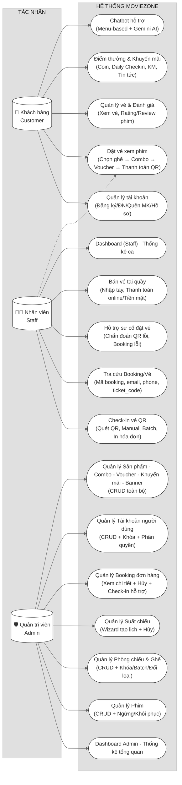

# SƠ ĐỒ USE CASE TỔNG QUAN HỆ THỐNG MOVIEZONE

```mermaid
%%{init: {'theme': 'dark', 'themeVariables': { 'actorBorders': '#fff', 'useCaseBorders': '#fff'}}}%%
flowchart TB
    %% ===== ACTORS =====
    Customer(("👤 Khách hàng<br/>Customer"))
    Staff(("🧑‍💼 Nhân viên<br/>Staff"))
    Admin(("🛡️ Quản trị viên<br/>Admin"))
    Google(("☁️ Google OAuth"))
    Sepay(("🏦 Sepay<br/>Payment Gateway"))
    Email(("📧 Email Service"))
    Gemini(("🤖 Gemini AI<br/>Chatbot"))

    subgraph KhachHang["NHÓM KHÁCH HÀNG"]
        direction TB
        UC01["UC-01 Đăng ký"]
        UC02["UC-02 Đăng nhập"]
        UC03["UC-03 Đăng xuất"]
        UC04["UC-04 Quên mật khẩu"]
        UC05["UC-05 Đặt lại mật khẩu"]
        UC06["UC-06 Xem/Sửa hồ sơ + Đổi mật khẩu"]
        UC07["UC-07 Xem danh sách phim (lọc/thể loại)"]
        UC08["UC-08 Xem chi tiết phim + Trailer"]
        UC09["UC-09 Xem lịch chiếu"]
        UC10["UC-10 Chọn suất chiếu"]
        UC11["UC-11 Chatbot hỗ trợ"]
        UC12["UC-12 Chọn ghế (giữ 5 phút)"]
        UC13["UC-13 Chọn Combo"]
        UC14["UC-14 Áp Voucher"]
        UC15["UC-15 Xác nhận đặt vé"]
        UC16["UC-16 Thanh toán QR Online"]
        UC17["UC-17 Xem vé đã mua"]
        UC18["UC-18 Đánh giá phim (Rating + Comment)"]
        UC19["UC-19 Sửa/Xóa đánh giá"]
        UC20["UC-20 Xem Coin"]
        UC21["UC-21 Điểm danh hàng ngày"]
        UC22["UC-22 Xem khuyến mãi"]
        UC23["UC-23 Xem tin tức"]
    end

    subgraph NhanVien["NHÓM NHÂN VIÊN"]
        direction TB
        US01["UC-S01 Dashboard Staff"]
        US02["UC-S02 Check-in vé QR"]
        US03["UC-S03 Tra cứu Booking/Vé"]
        US04["UC-S04 Hỗ trợ sự cố đặt vé"]
        US05["UC-S05 Bán vé tại quầy"]
    end

    subgraph QuanTri["NHÓM QUẢN TRỊ"]
        direction TB
        UA01["UC-A01 Dashboard Admin (thống kê)"]
        UA02["UC-A02 Quản lý Phim (CRUD + Ngừng/Khôi phục)"]
        UA03["UC-A03 Quản lý Phòng chiếu (CRUD + Ẩn)"]
        UA04["UC-A04 Quản lý Ghế (CRUD + Khóa + Batch)"]
        UA05["UC-A05 Quản lý Suất chiếu (Wizard + Hủy)"]
        UA06["UC-A06 Quản lý Booking (Xem + Hủy)"]
        UA07["UC-A07 Quản lý Tài khoản (CRUD + Khóa + Phân quyền)"]
        UA08["UC-A08 Quản lý Sản phẩm (CRUD)"]
        UA09["UC-A09 Quản lý Combo (CRUD)"]
        UA10["UC-A10 Quản lý Voucher (CRUD)"]
        UA11["UC-A11 Quản lý Khuyến mãi (CRUD)"]
        UA12["UC-A12 Quản lý Banner (CRUD)"]
    end

    %% ===== RELATIONSHIPS =====
    Customer --> UC01
    Customer --> UC02
    Customer --> UC03
    Customer --> UC04
    Customer --> UC05
    Customer --> UC06
    Customer --> UC07
    Customer --> UC08
    Customer --> UC09
    Customer --> UC10
    Customer --> UC11
    Customer --> UC12
    Customer --> UC13
    Customer --> UC14
    Customer --> UC15
    Customer --> UC16
    Customer --> UC17
    Customer --> UC18
    Customer --> UC19
    Customer --> UC20
    Customer --> UC21
    Customer --> UC22
    Customer --> UC23

    Staff --> US01
    Staff --> US02
    Staff --> US03
    Staff --> US04
    Staff --> US05

    Admin --> UA01
    Admin --> UA02
    Admin --> UA03
    Admin --> UA04
    Admin --> UA05
    Admin --> UA06
    Admin --> UA07
    Admin --> UA08
    Admin --> UA09
    Admin --> UA10
    Admin --> UA11
    Admin --> UA12

    %% Extends relationships
    UC10 -.->|«include»| UC12
    UC12 -.->|«include»| UC13
    UC13 -.->|«include»| UC14
    UC14 -.->|«include»| UC15
    UC15 -.->|«include»| UC16
    
    US05 -.->|«include»| UC12
    US05 -.->|«include»| UC13
    US05 -.->|«include»| UC15
    US05 -.->|«include»| UC16

    %% System actors
    UC02 -.->|auth via| Google
    UC16 -.->|payment via| Sepay
    UA05 -.->|notify via| Email
    UC11 -.->|powered by| Gemini
```

---

## 📊 SƠ ĐỒ USE CASE CẤP HỆ THỐNG (Dạng đơn giản hơn)

---

## 🎯 TÓM TẮT NHANH

| Actor | Số UC | Các nhóm chức năng chính |
|-------|-------|--------------------------|
| 👤 **Khách hàng** | **23 UC** | Tài khoản (6), Phim & Lịch chiếu (5), Đặt vé (5), Vé & Đánh giá (4), Điểm thưởng (3) |
| 🧑‍💼 **Nhân viên** | **5 UC** | Dashboard, Check-in QR, Tra cứu Booking, Hỗ trợ sự cố, Bán vé quầy |
| 🛡️ **Quản trị** | **~27 UC** | Dashboard, Phim, Phòng/Ghế, Suất chiếu, Booking, Tài khoản, Sản phẩm/Combo/Voucher/KM/Banner |
| **Tổng** | **~55 UC** | Toàn bộ nghiệp vụ hệ thống rạp chiếu phim MovieZone |

